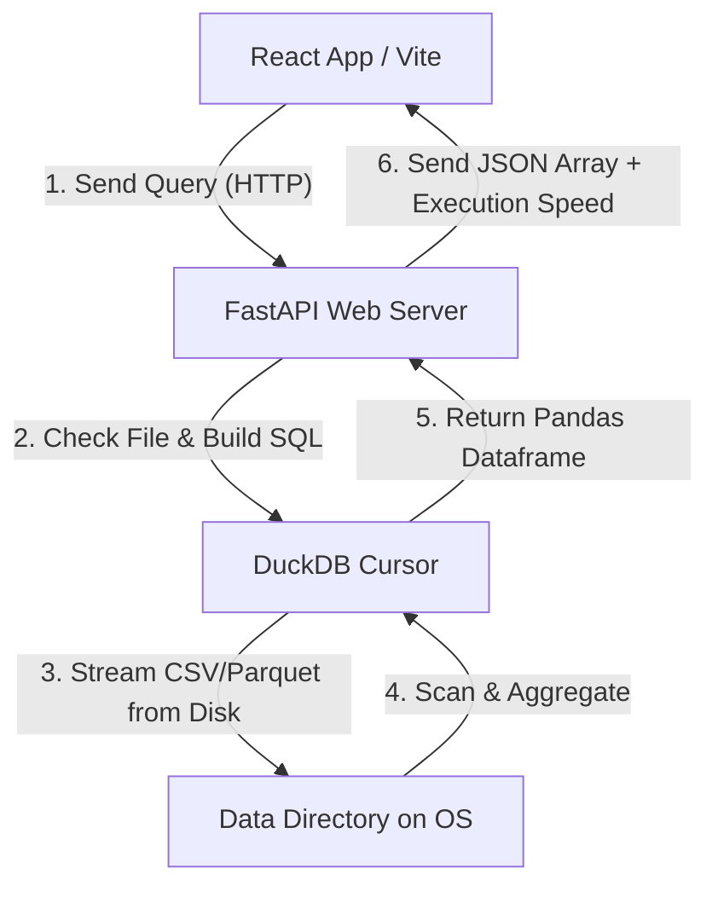

# Technical Architecture & Design Document

This document describes the technical architecture, design decisions, and data flow pipelines of the **DataMine** workspace.

---

## Architecture Overview

DataMine uses a decoupled client-server architecture designed to run locally. The system allows analytical exploration of large datasets by keeping all heavy lifting (aggregations, sorting, joins) inside a local column-store SQL engine.



---

## Key Components

### 1. Frontend Web Client (React + Recharts)
- **State Container**: Manages active tabs, file selections, custom query strings, schema mappings, error captures, and chart options.
- **Plotting Canvas (Recharts)**: Uses SVGs to dynamically plot multiple Y-Axis series binding to query headers. Handles Line, Bar, Area, Scatter, and Pie shapes.
- **Blob Exporter**: Compiles JSON data arrays into a CSV-formatted Blob client-side to trigger a native system download, avoiding backend roundtrips.

### 2. Backend Web Server (FastAPI)
- **Routing Engine**: Maps endpoints for file lists (`/datasets`), schemas (`/schema`), query runners (`/query`), file uploads (`/upload`), and conversion engines (`/convert`).
- **Form Parser (`python-multipart`)**: Handles incoming stream chunks for file uploads.

### 3. Database Engine (DuckDB)
- **Column-Store Engine**: DuckDB is designed for analytical queries (OLAP). Rather than loading files into RAM, it scans CSV/Parquet files out-of-core, bypassing memory constraints.
- **Parquet Writer**: Executes SQL commands to write data directly into Parquet files, optimizing disk usage and index speeds:
  `COPY (SELECT * FROM read_csv_auto('source.csv')) TO 'target.parquet' (FORMAT PARQUET)`

---

## Concurrency & Thread Safety

### The Problem
During development, a race condition occurred because DuckDB connections (`duckdb.connect()`) are shared across FastAPI's async request threads. Multiple concurrent calls (like the UI fetching `/schema` and `/query` simultaneously) would overwrite the global connection's internal buffer, leading to crashes.

### The Solution
We resolved this by using request-scoped local cursors. In `main.py`, instead of calling `con.execute()` directly on the global connection, we instantiate a thread-local cursor for each request:
```python
cursor = con.cursor()
df = cursor.execute(sql).df()
```
This isolates execution buffers per incoming thread, ensuring thread safety and preventing data-fetching collisions.

---

## File Conversion Pipeline

When a user converts a CSV to Parquet in the **Repository** tab:
1. React client sends a `POST` request to `/convert/filename.csv`.
2. The FastAPI backend opens a DuckDB cursor.
3. DuckDB streams the CSV file from disk, parses types, and writes it back as an optimized, compressed `.parquet` binary.
4. The backend deletes the original `.csv` file.
5. The dataset dropdown is updated, and all subsequent query commands switch to `read_parquet()` for 10x faster executions.
